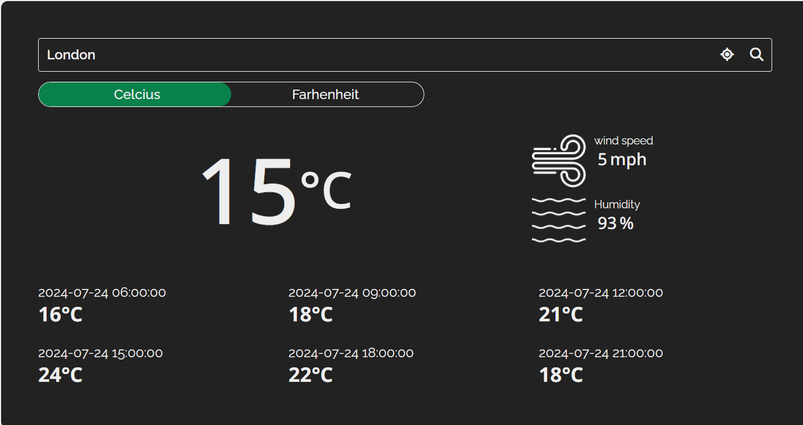
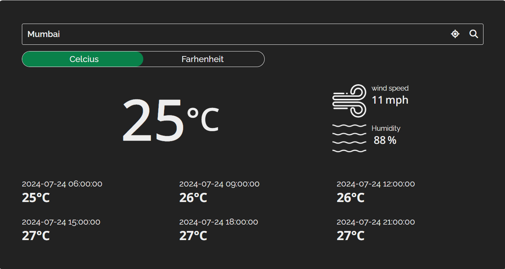
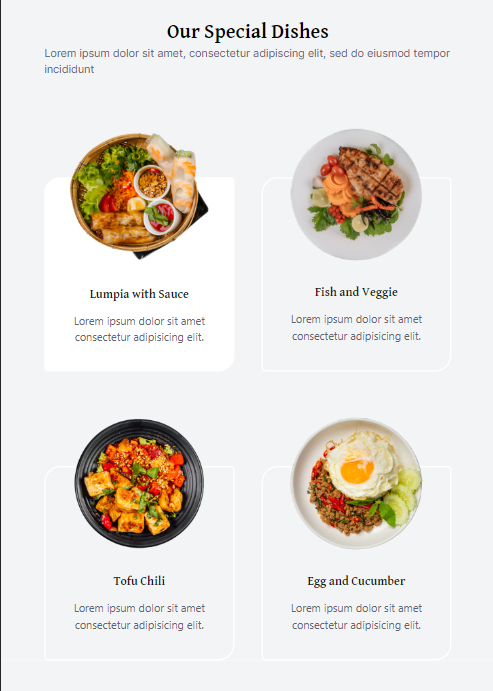
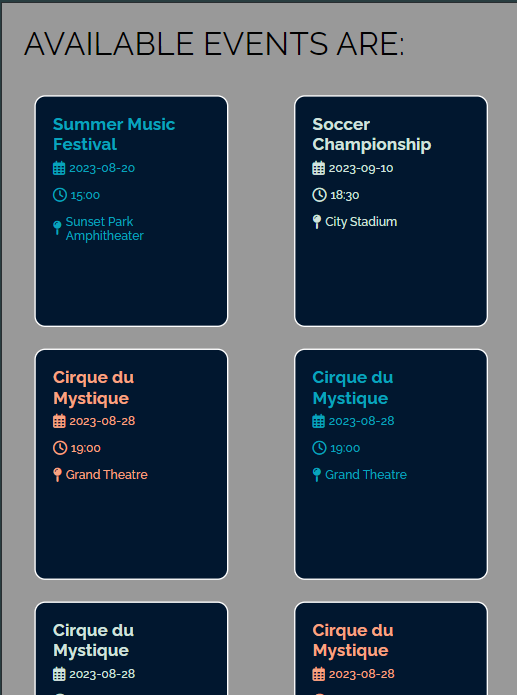
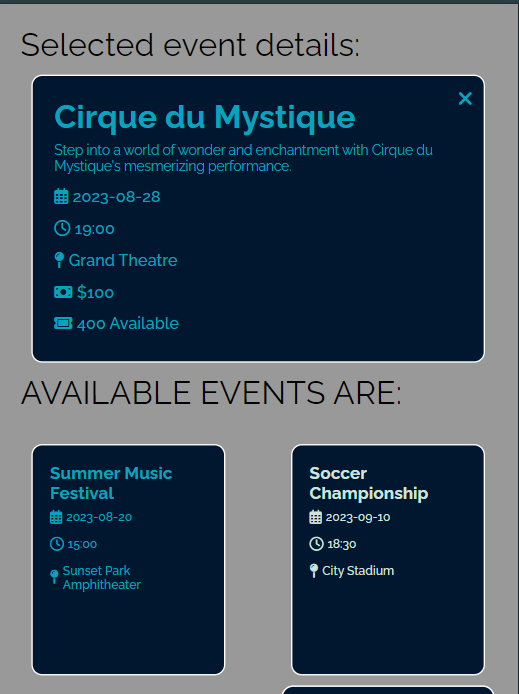
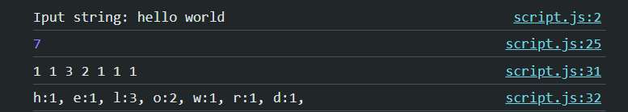
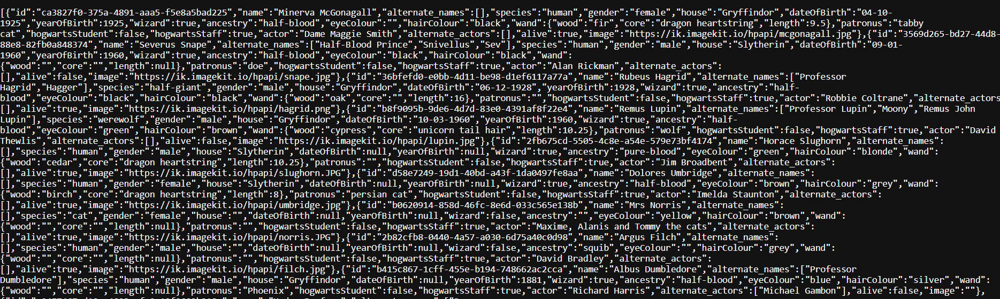
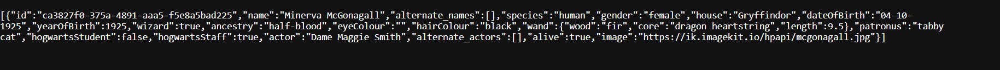

# Unicode-Frontend

1) First task completed: Frontend Task 2- Weather App ( using HTML, CSS and Javascript)
Its feautures include:
--> Current temperature, wind speed, humidity and weather forecast for the location entered by user , or the location of the user accepted from the browser

--> uses Geolocation API to convert the latitude and longitude of the user's location and gets the city name , which is used in the API ad the value for the city
Link for Geolocation API: https://openweathermap.org/api/geocoding-api#reverse

--> uses the city name from user input or user location to give forecast of the weather of the gievn location 
Link for Forecast API: https://openweathermap.org/forecast5#5days

2) Second task completed: Frontend Task 1- Restaurant Website UI Clone

The UI clone was made using HTML and Tailwind CSS. The clone has been made responsive to various screen sizes, using in-built tailwind utility classes for media queries 

 

3) Third Task Completed: Frontend Task 3- Backend Integration

Its features include:
--> Usgae of async await to tackle the asynchronous nature of API fetching and HTTP requests
--> Displaying the data fetched from the API on the front end in the form of cards that have hover animations
--> Dynamically displaying elaborate details of event when the event card is clicked. The function displays the data by accpeting the unique event id of the event 

 

4) Fourth Task Completed: Backend Task 1 - String Manipulation using javacript
The problem was solved by:
--> finding the unique characters and storing them in an array
--> looping through the array and counting frequency in the string 

5) Fifth Task Completed: Backend Task 2- Fetching data using get 
--> The task was completed by using GET requests from various paths of the url 
--> each path fetches a different data and that is displayed on the screen
--> a single character is displayed when the id of the character is part of the url 

